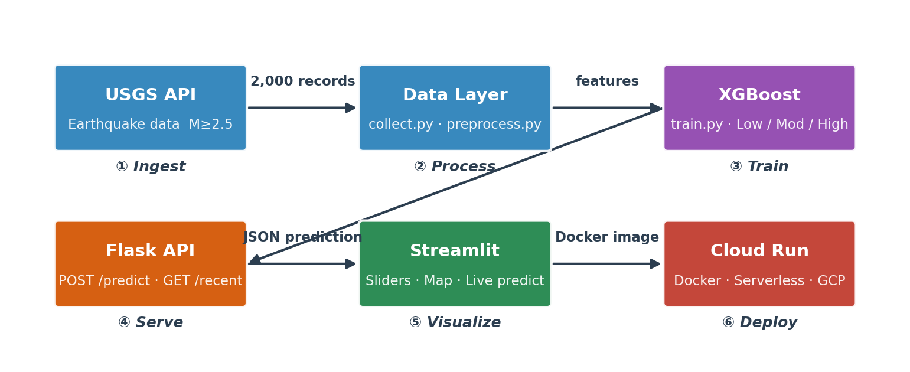
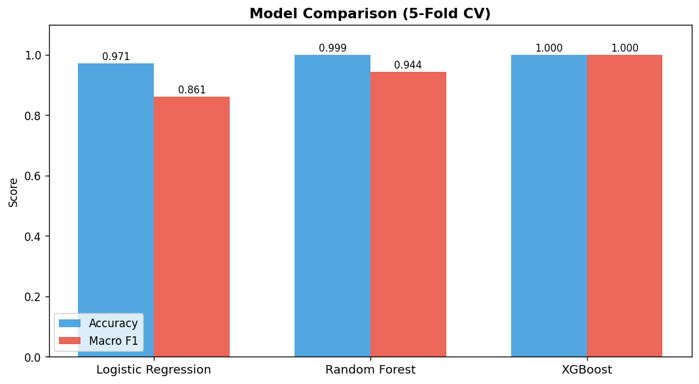
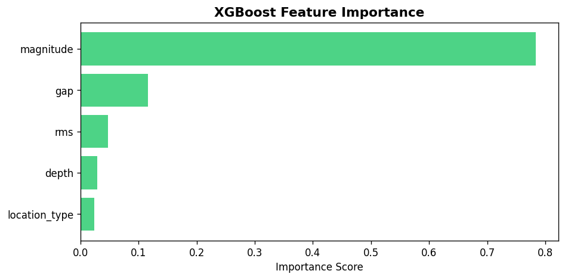

# EarthSafe 🌍

Real-time earthquake hazard prediction using USGS seismic data.

**Live App:** [earthsafe-eu9o2sytymwqnls48ppjg7.streamlit.app](https://earthsafe-eu9o2sytymwqnls48ppjg7.streamlit.app)  
**API:** [earthsafe-api-589990931603.us-central1.run.app](https://earthsafe-api-589990931603.us-central1.run.app) — `POST /predict`, `GET /recent`, `GET /health`  
**API Docs:** [/apidocs](https://earthsafe-api-589990931603.us-central1.run.app/apidocs)  
**GitHub:** [github.com/tt12049999/EarthSafe](https://github.com/tt12049999/EarthSafe)

---

## What it does

EarthSafe classifies earthquake hazard level — **Low / Moderate / High** — from seismic features (magnitude, depth, azimuthal gap, RMS, location type). Users can drag sliders to explore real-time predictions and view the latest 24h earthquakes on a world map.

- **Low** — M < 4.0 (minor shaking, rarely felt)
- **Moderate** — M 4.0–6.0 (widely felt, possible minor damage)
- **High** — M ≥ 6.0 (strong shaking, significant damage risk)

---

## Architecture



| Stage | Component | Technology |
|-------|-----------|------------|
| 1 Ingest | USGS API collector | Python `requests`, monthly chunks |
| 2 Process | Feature engineering | Pandas, scikit-learn |
| 3 Train | XGBoost classifier | XGBoost 2.0, `sample_weight` balancing |
| 4 Serve | REST API | Flask 3.0, Flask-CORS |
| 5 Visualize | Interactive frontend | Streamlit 1.35, Plotly |
| 6 Deploy | Serverless hosting | Streamlit Community Cloud |

---

## Project Structure

```
EarthSafe/
├── data/
│   ├── raw/               # USGS CSV (gitignored)
│   └── processed/         # EDA figures + architecture diagram
├── notebooks/
│   └── eda.ipynb          # Exploratory Data Analysis
├── src/
│   ├── data/
│   │   ├── collect.py     # USGS API collector (monthly chunks)
│   │   └── preprocess.py  # Feature engineering + labeling
│   ├── models/
│   │   └── train.py       # XGBoost + RF + LR comparison, 5-fold CV
│   ├── api/
│   │   └── app.py         # Flask prediction API (port 5001)
│   └── app/
│       └── streamlit_app.py  # Two-page Streamlit frontend
├── tests/
│   └── test_api.py        # Unit tests for API endpoints
├── deploy/
│   ├── deploy.sh          # Google Cloud Run deploy script
│   └── generate_architecture.py  # Architecture diagram generator
├── models/                # Trained model artifacts (.pkl)
├── Dockerfile.api         # Flask API container (port 8080)
├── Dockerfile.app         # Streamlit app container (port 8501)
├── docker-compose.yml     # Multi-service local dev
└── requirements.txt
```

---

## Quick Start

```bash
pip install -r requirements.txt

# 1. Collect data (~2 min, fetches 2023-2024 from USGS)
python src/data/collect.py

# 2. Explore the data
jupyter notebook notebooks/eda.ipynb

# 3. Train model (XGBoost + comparisons, ~30s)
python src/models/train.py

# 4. Start Flask API
python src/api/app.py        # runs on http://localhost:5001

# 5. Launch Streamlit app
streamlit run src/app/streamlit_app.py

# OR run both with Docker
docker-compose up
```

### API Usage

```bash
# Health check
curl http://localhost:5001/health

# Predict hazard level
curl -X POST http://localhost:5001/predict \
     -H "Content-Type: application/json" \
     -d '{"magnitude": 5.2, "depth": 30, "gap": 120, "rms": 0.5, "location_type": 1}'

# Response:
# {"hazard_label": "Moderate", "color": "#f39c12",
#  "probabilities": {"High": 0.003, "Low": 0.041, "Moderate": 0.956}, ...}

# Recent earthquakes (last 24h)
curl http://localhost:5001/recent?hours=24&minmagnitude=2.5
```

---

## Data

**Source:** [USGS Earthquake Hazards Program API](https://earthquake.usgs.gov/fdsnws/event/1/)  
**Period:** 2023–2024 | **Min magnitude:** M2.5 | **Records:** ~2,000  
**Features:** magnitude, depth, azimuthal gap, RMS travel-time residual, location_type (inland/offshore)

**Class distribution:**
| Label | Magnitude | Count | % |
|-------|-----------|-------|---|
| Low | M < 4.0 | ~1,030 | 51.6% |
| Moderate | M 4.0–6.0 | ~963 | 48.2% |
| High | M ≥ 6.0 | 7 | 0.4% |

---

## Model Results

| Model | Accuracy | Macro F1 |
|-------|----------|----------|
| Logistic Regression | 97.1% | 0.861 |
| Random Forest | 99.9% | 0.944 |
| **XGBoost** | **99.95%** | **1.000** |

XGBoost with `compute_sample_weight("balanced")` correctly classified all 7 High-hazard events across 5-fold CV.




---

## AI Assistant Usage

This project was developed with **Claude (Anthropic)** as the primary AI coding assistant throughout the full stack.

### Tools Used
- **Claude (claude.ai / Claude Code)** — primary assistant for all layers

### How AI Was Used

| Stage | Task | AI Contribution |
|-------|------|-----------------|
| Data | USGS API pagination | Designed monthly-chunk strategy to stay within 20k/request limit |
| Features | `location_type` engineering | Suggested parsing "of " pattern from place descriptions |
| Modeling | Class imbalance | Recommended `compute_sample_weight("balanced")` + manual CV loop workaround for XGBoost/sklearn API change |
| API | Flask error handling | Structured validation, CORS setup, USGS proxy with timeout |
| Frontend | Streamlit layout | Two-page structure, `@st.cache_data(ttl=300)` for live data |
| Docker | Multi-service setup | `Dockerfile.api` + `Dockerfile.app` + `docker-compose.yml` |
| Debugging | macOS port 5000 conflict | Diagnosed AirPlay Receiver issue, moved to port 5001 |
| Debugging | XGBoost `libomp` | Diagnosed missing OpenMP on macOS, `brew install libomp` |

### Key Prompting Strategies
- Providing full file context before asking for changes
- Asking for explanations of trade-offs (e.g., `class_weight` vs `sample_weight`)
- Iterative refinement — showing error messages directly and letting Claude diagnose

### Where AI Needed Correction
- Initial XGBoost CV used deprecated `fit_params` API in newer sklearn — required manual CV loop workaround
- Architecture diagram required several layout iterations (dark → light background, L-shaped → diagonal connector)
- Bar chart data labels required debugging through multiple `pptxgenjs` formatting options

### Lessons Learned
AI assistants dramatically reduce time on boilerplate (Docker, CORS, API validation) but still require domain knowledge to catch subtle issues like class imbalance metrics and model evaluation methodology.

---

## Deployment Notes

- **Streamlit app** hosted on [Streamlit Community Cloud](https://streamlit.io/cloud) (free tier)  
  URL: `https://earthsafe-eu9o2sytymwqnls48ppjg7.streamlit.app`
- **Flask API** deployed on [Google Cloud Run](https://cloud.google.com/run) (project: stat418-iris-api, region: us-central1)  
  URL: `https://earthsafe-api-589990931603.us-central1.run.app`  
  Docs: `https://earthsafe-api-589990931603.us-central1.run.app/apidocs`
- Services remain live through **June 9, 2026**

---

## Course

UCLA STAT 418 — Tools in Data Science, Spring 2026  
Instructor: Nate Langholz | Student: Yutong Ma (ytm02)
